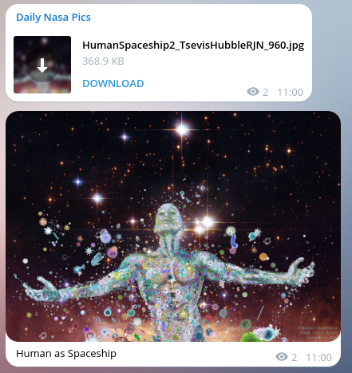

## Daily Nasa Pics

Every day NASA publishes a photo through its open api. 
Since I really like those images and I usually share them with my friends I decided to create this bot.

It justs download a JSON through the api once per day (using cron on openshift), and
then sends: The title, the normal pic as photo and the hd pic as a document to a telegram channel.

## Pictures

## Like it?

[Join the telegram channel](https://telegram.me/dailynasapictures) **and star this repo!**

## Usage

If you want to host yours, just download it, modify the config.js in config folder with
the required parameters and enjoy!

## License 

MIT
